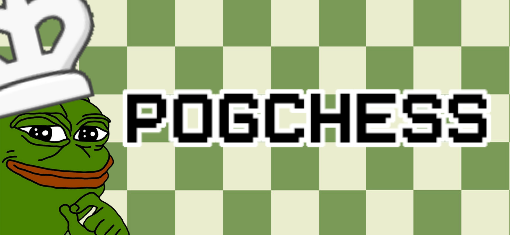

<p align="center">
    <br>
    
    
    
    
<p align="center">A CLI chess engine made with C++</p>

## Demo
(add gif of the CLI demonstration in the future)

## Prerequesites
| `Software` | `Download link` | `Required` | `Notes` |
|---|---|---|---|
| **Git** | https://git-scm.com/downloads |  | You can either download it using git or by downloading a [zip version](https://github.com/Existential-nonce/PogChess/archive/refs/heads/main.zip) of the repository |
| **CMake** | https://cmake.org/download/ |  | Required for building the entire code


## Download
```bash
git clone https://github.com/Existential-nonce/PogChess.git
```

## Install
```bash
chmod +x PogChess
cd PogChess
sudo make
```

## Docs 
Please read the [documentation](https://github.com/Existential-nonce/PogChess/blob/main/docs/Documentation.md) to read about the process of the project, the intentions I had, the algorithm used for the engine, etc... The documentation was specifically designed for my highschool programming project for my A level CS class.

## Credits

### Resources:
* https://www.youtube.com/playlist?list=PLZ1QII7yudbc-Ky058TEaOstZHVbT-2hg
* https://www.chessprogramming.org/

### Contributors
